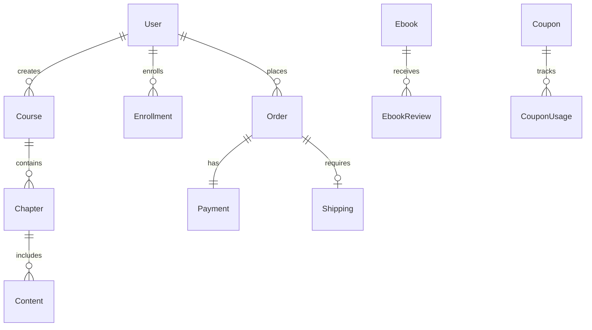

# System Documentation Design

## Overview

การออกแบบ documentation ที่ครอบคลุมสำหรับระบบ E-Learning โดยวิเคราะห์จาก database schema และสร้างเอกสารที่เข้าใจง่าย มีโครงสร้างชัดเจน และครอบคลุมทุกส่วนของระบบ

## Architecture

### Documentation Structure
```
docs/
├── README.md                     # Overview และ Getting Started
├── modules/                      # Module Documentation
│   ├── authentication.md         # User, Account, Session
│   ├── course-management.md      # Course, Chapter, Content, Category
│   ├── enrollment-system.md      # Enrollment, Progress Tracking
│   ├── ebook-system.md          # Ebook, EbookCategory, EbookReview
│   ├── order-management.md      # Order, OrderItem, Payment
│   ├── shipping-system.md       # Shipping, Tracking
│   ├── coupon-system.md         # Coupon, CouponUsage, Discounts
│   ├── content-management.md    # Post, PostType, CMS
│   ├── exam-bank.md            # ExamBank, ExamCategory, ExamFile
│   └── download-management.md   # EbookDownload, Access Control
├── database/                    # Database Documentation
│   ├── schema-overview.md       # Complete Schema Overview
│   ├── relationships.md         # Entity Relationships
│   ├── enums.md                # Enum Definitions
│   └── constraints.md          # Constraints and Indexes
├── workflows/                   # Business Process Documentation
│   ├── user-journey.md         # Complete User Journeys
│   ├── purchase-flow.md        # Purchase and Payment Flow
│   ├── course-creation.md      # Course Creation Workflow
│   └── admin-workflows.md      # Administrative Processes
├── integrations/               # External Integrations
│   ├── nextauth.md            # NextAuth Configuration
│   ├── line-login.md          # LINE Login Integration
│   ├── cloudinary.md          # File Upload and Management
│   └── payment-gateways.md    # Payment Processing
└── api/                       # API Documentation
    ├── authentication.md      # Auth Endpoints
    ├── courses.md            # Course Management APIs
    ├── orders.md             # Order Management APIs
    └── admin.md              # Admin Panel APIs
```

## Components and Interfaces

### 1. Module Documentation Components

#### Authentication Module
- **User Management**: User registration, login, profile management
- **Social Login**: LINE Login integration with NextAuth
- **Session Management**: JWT tokens, session persistence
- **Role-based Access**: ADMIN, INSTRUCTOR, STUDENT roles

#### Course Management Module
- **Course Creation**: Title, description, pricing, categories
- **Content Structure**: Chapters and content organization
- **Content Types**: VIDEO, PDF, LINK, QUIZ, ASSIGNMENT
- **Publishing Workflow**: DRAFT → PUBLISHED → CLOSED

#### E-commerce Module
- **Order Processing**: Cart, checkout, payment
- **Multiple Item Types**: Courses and Ebooks in single order
- **Payment Integration**: Bank transfer, slip verification
- **Shipping Management**: Physical ebook delivery

#### Content Management Module
- **Post System**: News, announcements, blog posts
- **Category Management**: Flexible post categorization
- **Media Management**: Image uploads via Cloudinary
- **SEO Features**: Slugs, excerpts, featured content

### 2. Database Design Patterns

#### Entity Relationships


#### Key Design Patterns
- **Soft Deletes**: Using `isActive` flags instead of hard deletes
- **Audit Trails**: `createdAt` and `updatedAt` timestamps
- **Flexible Relationships**: Optional foreign keys for extensibility
- **Enum Constraints**: Type safety for status fields

### 3. Workflow Documentation Structure

#### User Journey Mapping
- **Student Journey**: Registration → Course Discovery → Purchase → Learning
- **Instructor Journey**: Registration → Course Creation → Content Upload → Student Management
- **Admin Journey**: System Management → Order Processing → Content Moderation

#### Business Process Flows
- **Purchase Flow**: Cart → Checkout → Payment → Verification → Access Grant
- **Course Creation**: Draft → Content Upload → Review → Publish
- **Ebook Management**: Upload → Categorization → Pricing → Distribution

## Data Models

### Core Entities

#### User Entity
```typescript
interface User {
  id: string
  email?: string          // Optional for LINE users
  name?: string
  password?: string       // Hashed, optional for social login
  image?: string         // Profile image URL
  lineId?: string        // LINE User ID for social login
  role: 'ADMIN' | 'INSTRUCTOR' | 'STUDENT'
  createdAt: Date
  updatedAt: Date
}
```

#### Course Entity
```typescript
interface Course {
  id: string
  title: string
  description?: string
  price: number
  duration?: number      // In minutes
  isFree: boolean
  status: 'DRAFT' | 'PUBLISHED' | 'CLOSED'
  instructorId: string
  categoryId?: string
  coverImageUrl?: string
  chapters: Chapter[]
  enrollments: Enrollment[]
}
```

#### Order Entity
```typescript
interface Order {
  id: string
  orderNumber: string    // Human-readable order ID
  userId: string
  orderType: 'COURSE' | 'EBOOK' | 'MIXED'
  status: OrderStatus
  subtotal: number
  shippingFee: number
  tax: number
  discount: number
  couponDiscount: number
  total: number
  items: OrderItem[]
  payment?: Payment
  shipping?: Shipping
}
```

## Error Handling

### Validation Rules
- **Email Validation**: RFC 5322 compliant email format
- **Price Validation**: Non-negative numbers with 2 decimal places
- **File Upload**: Size limits, type restrictions
- **Coupon Validation**: Date ranges, usage limits, minimum order amounts

### Error Response Patterns
```typescript
interface ErrorResponse {
  success: false
  error: string
  code?: string
  details?: Record<string, string[]>
}
```

### Common Error Scenarios
- **Authentication Errors**: Invalid credentials, expired sessions
- **Authorization Errors**: Insufficient permissions
- **Validation Errors**: Invalid input data
- **Business Logic Errors**: Coupon expired, course not available
- **Integration Errors**: Payment gateway failures, file upload issues

## Testing Strategy

### Unit Testing
- **Model Validation**: Test all Prisma model constraints
- **Business Logic**: Test calculation functions (pricing, discounts)
- **Utility Functions**: Test helper functions and formatters

### Integration Testing
- **API Endpoints**: Test all CRUD operations
- **Authentication Flow**: Test login/logout scenarios
- **Payment Processing**: Test order creation and payment verification
- **File Upload**: Test Cloudinary integration

### End-to-End Testing
- **User Workflows**: Complete user journeys from registration to course completion
- **Admin Workflows**: Course management, order processing
- **Error Scenarios**: Test error handling and recovery

### Performance Testing
- **Database Queries**: Optimize N+1 queries
- **File Upload**: Test large file handling
- **Concurrent Users**: Test system under load