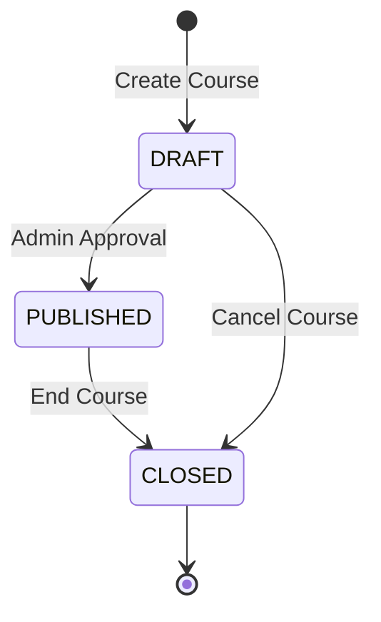

# Course Management API Documentation

## Overview

Course Management API จัดการคอร์สเรียน การลงทะเบียน และเนื้อหาการเรียน รองรับทั้ง public endpoints สำหรับผู้ใช้ทั่วไป และ admin endpoints สำหรับการจัดการ

## Public Course Endpoints

### 1. Get All Published Courses

#### GET `/api/courses`
ดึงรายการคอร์สที่เผยแพร่แล้วสำหรับผู้ใช้ทั่วไป

**Query Parameters:**
- ไม่มี (แสดงคอร์สที่ status = 'PUBLISHED' เท่านั้น)

**Response Success (200):**
```json
{
  "success": true,
  "data": [
    {
      "id": "course_id",
      "title": "Course Title",
      "description": "Course description",
      "price": 1500,
      "duration": 120,
      "isFree": false,
      "status": "PUBLISHED",
      "coverImageUrl": "https://cloudinary.com/image.jpg",
      "createdAt": "2024-01-01T00:00:00.000Z",
      "instructor": {
        "id": "instructor_id",
        "name": "Instructor Name",
        "email": "instructor@example.com"
      },
      "category": {
        "id": "category_id",
        "name": "Category Name",
        "description": "Category description"
      },
      "_count": {
        "enrollments": 25,
        "chapters": 8
      }
    }
  ]
}
```

### 2. Get Single Course

#### GET `/api/courses/[id]`
ดึงข้อมูลคอร์สเดี่ยวพร้อมรายละเอียดบทเรียน

**Path Parameters:**
- `id`: Course ID

**Response Success (200):**
```json
{
  "success": true,
  "data": {
    "id": "course_id",
    "title": "Course Title",
    "description": "Course description",
    "price": 1500,
    "duration": 120,
    "isFree": false,
    "status": "PUBLISHED",
    "coverImageUrl": "https://cloudinary.com/image.jpg",
    "instructor": {
      "id": "instructor_id",
      "name": "Instructor Name",
      "email": "instructor@example.com"
    },
    "category": {
      "id": "category_id",
      "name": "Category Name",
      "description": "Category description"
    },
    "chapters": [
      {
        "id": "chapter_id",
        "title": "Chapter 1",
        "description": "Chapter description",
        "order": 1,
        "contents": [
          {
            "id": "content_id",
            "title": "Lesson 1",
            "contentType": "VIDEO",
            "order": 1
          }
        ]
      }
    ],
    "_count": {
      "enrollments": 25
    }
  }
}
```

**Response Error (404):**
```json
{
  "success": false,
  "error": "ไม่พบคอร์สที่ระบุ"
}
```

## Enrollment Endpoints

### 1. Get User Enrollments

#### GET `/api/my-courses`
ดึงรายการคอร์สที่ผู้ใช้ลงทะเบียนแล้ว (ต้อง authenticate)

**Headers:**
```
Authorization: Bearer <jwt_token>
```

**Response Success (200):**
```json
{
  "success": true,
  "data": [
    {
      "id": "enrollment_id",
      "status": "ACTIVE",
      "progress": 75,
      "enrolledAt": "2024-01-01T00:00:00.000Z",
      "course": {
        "id": "course_id",
        "title": "Course Title",
        "description": "Course description",
        "coverImageUrl": "https://cloudinary.com/image.jpg",
        "instructor": {
          "name": "Instructor Name"
        }
      }
    }
  ]
}
```

### 2. Create Enrollment

#### POST `/api/enrollments`
ลงทะเบียนเรียนคอร์ส (ต้อง authenticate)

**Headers:**
```
Authorization: Bearer <jwt_token>
```

**Request Body:**
```json
{
  "courseId": "course_id"
}
```

**Response Success (200):**
```json
{
  "success": true,
  "message": "ลงทะเบียนเรียนสำเร็จ",
  "data": {
    "id": "enrollment_id",
    "userId": "user_id",
    "courseId": "course_id",
    "status": "ACTIVE",
    "progress": 0,
    "enrolledAt": "2024-01-01T00:00:00.000Z"
  }
}
```

## Admin Course Management

### 1. Get All Courses (Admin)

#### GET `/api/admin/courses`
ดึงรายการคอร์สทั้งหมดสำหรับ admin (ทุก status)

**Headers:**
```
Authorization: Bearer <admin_jwt_token>
```

**Response Success (200):**
```json
{
  "success": true,
  "data": [
    {
      "id": "course_id",
      "title": "Course Title",
      "description": "Course description",
      "price": 1500,
      "duration": 120,
      "isFree": false,
      "status": "DRAFT",
      "instructor": {
        "id": "instructor_id",
        "name": "Instructor Name",
        "email": "instructor@example.com",
        "role": "INSTRUCTOR"
      },
      "category": {
        "id": "category_id",
        "name": "Category Name"
      },
      "chapters": [],
      "enrollments": []
    }
  ]
}
```

### 2. Create Course (Admin)

#### POST `/api/admin/courses`
สร้างคอร์สใหม่

**Headers:**
```
Authorization: Bearer <admin_jwt_token>
Content-Type: application/json
```

**Request Body:**
```json
{
  "title": "New Course Title",
  "description": "Course description",
  "price": 1500,
  "duration": 120,
  "isFree": false,
  "status": "DRAFT",
  "instructorId": "instructor_id",
  "categoryId": "category_id",
  "coverImageUrl": "https://cloudinary.com/image.jpg",
  "coverPublicId": "cloudinary_public_id"
}
```

**Response Success (200):**
```json
{
  "success": true,
  "data": {
    "id": "new_course_id",
    "title": "New Course Title",
    "description": "Course description",
    "price": 1500,
    "duration": 120,
    "isFree": false,
    "status": "DRAFT",
    "instructorId": "instructor_id",
    "categoryId": "category_id",
    "coverImageUrl": "https://cloudinary.com/image.jpg",
    "coverPublicId": "cloudinary_public_id",
    "createdAt": "2024-01-01T00:00:00.000Z",
    "updatedAt": "2024-01-01T00:00:00.000Z"
  }
}
```

### 3. Update Course (Admin)

#### PUT `/api/admin/courses?id=course_id`
อัปเดตข้อมูลคอร์ส

**Headers:**
```
Authorization: Bearer <admin_jwt_token>
Content-Type: application/json
```

**Query Parameters:**
- `id`: Course ID ที่ต้องการอัปเดต

**Request Body:**
```json
{
  "title": "Updated Course Title",
  "description": "Updated description",
  "price": 2000,
  "duration": 150,
  "isFree": false,
  "status": "PUBLISHED",
  "instructorId": "instructor_id",
  "categoryId": "category_id",
  "coverImageUrl": "https://cloudinary.com/new-image.jpg",
  "coverPublicId": "new_cloudinary_public_id"
}
```

**Response Success (200):**
```json
{
  "success": true,
  "data": {
    "id": "course_id",
    "title": "Updated Course Title",
    "description": "Updated description",
    "price": 2000,
    "duration": 150,
    "isFree": false,
    "status": "PUBLISHED",
    "updatedAt": "2024-01-01T00:00:00.000Z"
  }
}
```

### 4. Delete Course (Admin)

#### DELETE `/api/admin/courses?id=course_id`
ลบคอร์ส

**Headers:**
```
Authorization: Bearer <admin_jwt_token>
```

**Query Parameters:**
- `id`: Course ID ที่ต้องการลบ

**Response Success (200):**
```json
{
  "success": true
}
```

## Course Status Workflow



## Validation Rules

### Course Creation/Update
- **title**: Required, string, max 255 characters
- **description**: Optional, text
- **price**: Number, >= 0, max 2 decimal places
- **duration**: Optional, integer (minutes)
- **isFree**: Boolean, default false
- **status**: Enum ['DRAFT', 'PUBLISHED', 'CLOSED']
- **instructorId**: Required, valid User ID with INSTRUCTOR role
- **categoryId**: Optional, valid Category ID
- **coverImageUrl**: Optional, valid URL
- **coverPublicId**: Optional, string (Cloudinary public ID)

### Enrollment Rules
- User ต้อง authenticate
- Course ต้องมี status = 'PUBLISHED'
- User ต้องไม่ได้ลงทะเบียนคอร์สนี้แล้ว
- ถ้าคอร์สไม่ฟรี ต้องมี completed order ก่อน

## Testing Scenarios

### Unit Tests
```javascript
describe('Course API', () => {
  test('GET /api/courses should return published courses only', async () => {
    const response = await request(app).get('/api/courses');
    
    expect(response.status).toBe(200);
    expect(response.body.success).toBe(true);
    expect(response.body.data).toBeInstanceOf(Array);
    
    // Verify all courses are published
    response.body.data.forEach(course => {
      expect(course.status).toBe('PUBLISHED');
    });
  });

  test('POST /api/admin/courses should create course with valid data', async () => {
    const courseData = {
      title: 'Test Course',
      description: 'Test Description',
      price: 1000,
      instructorId: 'valid_instructor_id',
      status: 'DRAFT'
    };

    const response = await request(app)
      .post('/api/admin/courses')
      .set('Authorization', `Bearer ${adminToken}`)
      .send(courseData);

    expect(response.status).toBe(200);
    expect(response.body.success).toBe(true);
    expect(response.body.data.title).toBe(courseData.title);
  });
});
```

### Integration Tests
```javascript
describe('Course Enrollment Flow', () => {
  test('should complete full enrollment process', async () => {
    // 1. Create course
    // 2. Publish course
    // 3. User enrolls
    // 4. Verify enrollment
    // 5. Check user's enrolled courses
  });
});
```

## Common Error Codes

| Status | Error Message | Description |
|--------|---------------|-------------|
| 400 | Missing id | Course ID not provided |
| 400 | ข้อมูลไม่ครบถ้วน | Required fields missing |
| 401 | Unauthorized | Authentication required |
| 403 | Forbidden | Insufficient permissions |
| 404 | ไม่พบคอร์สที่ระบุ | Course not found |
| 409 | คุณได้ลงทะเบียนคอร์สนี้แล้ว | Already enrolled |
| 500 | เกิดข้อผิดพลาดในการดึงข้อมูลคอร์ส | Server error |