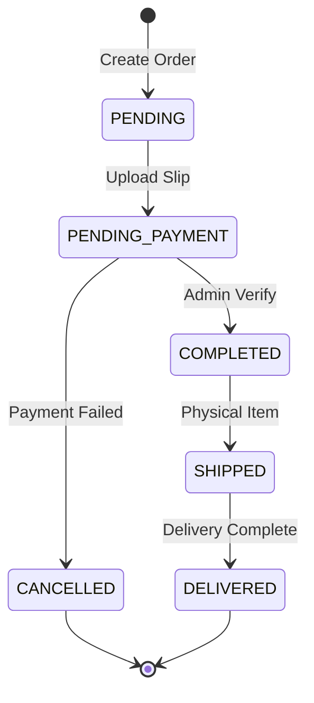
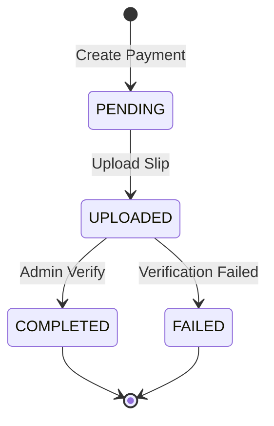

# Order Management API Documentation

## Overview

Order Management API จัดการคำสั่งซื้อ การชำระเงิน และการจัดส่งสินค้า รองรับทั้งคอร์สเรียนและ e-book พร้อมระบบคูปองส่วนลด

## Order Endpoints

### 1. Create Order

#### POST `/api/orders`
สร้างคำสั่งซื้อใหม่สำหรับคอร์สหรือ e-book

**Headers:**
```
Authorization: Bearer <jwt_token>
Content-Type: application/json
```

**Request Body:**
```json
{
  "userId": "user_id",
  "itemType": "course", // "course" | "ebook"
  "itemId": "item_id",
  "couponCode": "DISCOUNT10", // Optional
  "shippingAddress": { // Required for physical ebooks
    "name": "Recipient Name",
    "phone": "0812345678",
    "address": "123 Main St",
    "district": "District",
    "province": "Province",
    "postalCode": "12345"
  }
}
```

**Response Success (200) - Paid Item:**
```json
{
  "success": true,
  "message": "สร้างคำสั่งซื้อสำเร็จ",
  "data": {
    "orderId": "order_id",
    "paymentId": "payment_id",
    "paymentRef": "ORD1234567890ABCDE",
    "total": 1350,
    "isFree": false
  }
}
```

**Response Success (200) - Free Item:**
```json
{
  "success": true,
  "message": "ลงทะเบียนฟรีสำเร็จ",
  "data": {
    "orderId": "order_id",
    "isFree": true
  }
}
```

**Response Error (400):**
```json
{
  "success": false,
  "error": "คุณได้ซื้อสินค้านี้แล้ว"
}
```

### 2. Get User Orders

#### GET `/api/orders?userId=user_id`
ดึงรายการคำสั่งซื้อของผู้ใช้

**Headers:**
```
Authorization: Bearer <jwt_token>
```

**Query Parameters:**
- `userId`: User ID (required)

**Response Success (200):**
```json
{
  "success": true,
  "data": [
    {
      "id": "order_id",
      "orderType": "COURSE",
      "status": "COMPLETED",
      "subtotal": 1500,
      "shippingFee": 0,
      "couponDiscount": 150,
      "total": 1350,
      "couponCode": "DISCOUNT10",
      "createdAt": "2024-01-01T00:00:00.000Z",
      "course": {
        "title": "Course Title",
        "description": "Course description",
        "instructor": {
          "name": "Instructor Name"
        }
      },
      "ebook": null,
      "payment": {
        "id": "payment_id",
        "method": "BANK_TRANSFER",
        "status": "COMPLETED",
        "amount": 1350,
        "paidAt": "2024-01-01T01:00:00.000Z",
        "ref": "ORD1234567890ABCDE"
      },
      "shipping": null
    }
  ]
}
```

### 3. Get Single Order

#### GET `/api/orders/[id]`
ดึงข้อมูลคำสั่งซื้อเดี่ยว

**Headers:**
```
Authorization: Bearer <jwt_token>
```

**Path Parameters:**
- `id`: Order ID

**Response Success (200):**
```json
{
  "success": true,
  "data": {
    "id": "order_id",
    "orderType": "EBOOK",
    "status": "COMPLETED",
    "subtotal": 500,
    "shippingFee": 50,
    "couponDiscount": 0,
    "total": 550,
    "createdAt": "2024-01-01T00:00:00.000Z",
    "user": {
      "id": "user_id",
      "name": "User Name",
      "email": "user@example.com"
    },
    "course": null,
    "ebook": {
      "id": "ebook_id",
      "title": "Ebook Title",
      "description": "Ebook description",
      "price": 500,
      "discountPrice": 500,
      "author": "Author Name",
      "isPhysical": true
    },
    "payment": {
      "id": "payment_id",
      "method": "BANK_TRANSFER",
      "status": "COMPLETED",
      "paidAt": "2024-01-01T01:00:00.000Z",
      "ref": "ORD1234567890ABCDE",
      "slipUrl": "https://cloudinary.com/slip.jpg",
      "uploadedAt": "2024-01-01T00:30:00.000Z",
      "verifiedAt": "2024-01-01T01:00:00.000Z"
    },
    "shipping": {
      "id": "shipping_id",
      "recipientName": "Recipient Name",
      "recipientPhone": "0812345678",
      "address": "123 Main St",
      "district": "District",
      "province": "Province",
      "postalCode": "12345",
      "status": "DELIVERED",
      "trackingNumber": "TH123456789",
      "shippedAt": "2024-01-02T00:00:00.000Z",
      "deliveredAt": "2024-01-03T00:00:00.000Z"
    }
  }
}
```

## Payment Endpoints

### 1. Upload Payment Slip

#### POST `/api/payments/upload-slip`
อัปโหลดสลิปการโอนเงิน

**Headers:**
```
Authorization: Bearer <jwt_token>
Content-Type: multipart/form-data
```

**Request Body (FormData):**
```
paymentId: payment_id
slip: <file> // Image file (JPG, PNG)
```

**Response Success (200):**
```json
{
  "success": true,
  "message": "อัปโหลดสลิปสำเร็จ",
  "data": {
    "paymentId": "payment_id",
    "slipUrl": "https://cloudinary.com/slip.jpg",
    "uploadedAt": "2024-01-01T00:30:00.000Z"
  }
}
```

## Admin Order Management

### 1. Get All Orders (Admin)

#### GET `/api/admin/orders`
ดึงรายการคำสั่งซื้อทั้งหมดสำหรับ admin

**Headers:**
```
Authorization: Bearer <admin_jwt_token>
```

**Query Parameters:**
- `status`: Order status filter (optional)
- `paymentStatus`: Payment status filter (optional)
- `page`: Page number (default: 1)
- `limit`: Items per page (default: 50)

**Response Success (200):**
```json
{
  "success": true,
  "data": [
    {
      "id": "order_id",
      "orderType": "COURSE",
      "status": "PENDING_PAYMENT",
      "subtotal": 1500,
      "shippingFee": 0,
      "couponDiscount": 0,
      "total": 1500,
      "createdAt": "2024-01-01T00:00:00.000Z",
      "user": {
        "id": "user_id",
        "name": "User Name",
        "email": "user@example.com"
      },
      "course": {
        "id": "course_id",
        "title": "Course Title",
        "description": "Course description",
        "price": 1500,
        "instructor": {
          "name": "Instructor Name"
        }
      },
      "ebook": null,
      "payment": {
        "id": "payment_id",
        "method": "BANK_TRANSFER",
        "status": "PENDING",
        "ref": "ORD1234567890ABCDE",
        "slipUrl": "https://cloudinary.com/slip.jpg",
        "uploadedAt": "2024-01-01T00:30:00.000Z",
        "verifiedAt": null
      },
      "shipping": null
    }
  ],
  "pagination": {
    "page": 1,
    "limit": 50,
    "total": 150,
    "pages": 3
  }
}
```

## Order Status Workflow



## Payment Status Workflow



## Coupon System

### Coupon Types
- **PERCENTAGE**: ส่วนลดเป็นเปอร์เซ็นต์
- **FIXED_AMOUNT**: ส่วนลดจำนวนคงที่
- **FREE_SHIPPING**: ฟรีค่าจัดส่ง

### Coupon Validation Rules
- วันที่ใช้งาน (validFrom - validUntil)
- จำนวนครั้งการใช้งานทั้งหมด (usageLimit)
- จำนวนครั้งการใช้งานต่อผู้ใช้ (userUsageLimit)
- ยอดขั้นต่ำ (minOrderAmount)
- ส่วนลดสูงสุด (maxDiscount) สำหรับ PERCENTAGE

## Validation Rules

### Order Creation
- **userId**: Required, valid User ID
- **itemType**: Required, enum ['course', 'ebook']
- **itemId**: Required, valid Course/Ebook ID
- **couponCode**: Optional, valid active coupon
- **shippingAddress**: Required for physical ebooks

### Shipping Address
- **name**: Required, string, max 100 characters
- **phone**: Required, string, Thai phone format
- **address**: Required, string, max 255 characters
- **district**: Required, string, max 100 characters
- **province**: Required, string, max 100 characters
- **postalCode**: Required, string, 5 digits

## Testing Scenarios

### Unit Tests
```javascript
describe('Order API', () => {
  test('POST /api/orders should create order with valid data', async () => {
    const orderData = {
      userId: 'valid_user_id',
      itemType: 'course',
      itemId: 'valid_course_id'
    };

    const response = await request(app)
      .post('/api/orders')
      .set('Authorization', `Bearer ${userToken}`)
      .send(orderData);

    expect(response.status).toBe(200);
    expect(response.body.success).toBe(true);
    expect(response.body.data).toHaveProperty('orderId');
  });

  test('should apply coupon discount correctly', async () => {
    const orderData = {
      userId: 'valid_user_id',
      itemType: 'course',
      itemId: 'valid_course_id',
      couponCode: 'DISCOUNT10'
    };

    const response = await request(app)
      .post('/api/orders')
      .set('Authorization', `Bearer ${userToken}`)
      .send(orderData);

    expect(response.body.data.total).toBeLessThan(originalPrice);
  });
});
```

### Integration Tests
```javascript
describe('Complete Order Flow', () => {
  test('should complete full purchase process', async () => {
    // 1. Create order
    // 2. Upload payment slip
    // 3. Admin verify payment
    // 4. Check order completion
    // 5. Verify user access to item
  });
});
```

## Common Error Codes

| Status | Error Message | Description |
|--------|---------------|-------------|
| 400 | ข้อมูลไม่ครบถ้วน | Required fields missing |
| 400 | คุณได้ซื้อสินค้านี้แล้ว | Item already purchased |
| 401 | Unauthorized | Authentication required |
| 404 | ไม่พบผู้ใช้งาน | User not found |
| 404 | ไม่พบสินค้า | Item not found |
| 404 | ไม่พบคำสั่งซื้อ | Order not found |
| 500 | เกิดข้อผิดพลาดในการสร้างคำสั่งซื้อ | Server error |